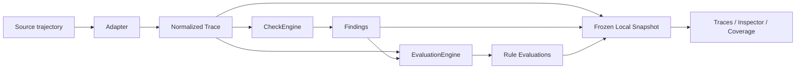

# MMTrace

English | [简体中文](README.zh-CN.md)

[](https://github.com/Gnomeshgh412/mmtrace/actions/workflows/tests.yml)

[](LICENSE)

Deterministic reliability checking, trace inspection, and evidence-aware coverage for multimodal and computer-use agents.

MMTrace checks deterministic reliability invariants across the evidence chain of recorded agent trajectories:

```text
Observation -> Model Context -> Action -> Execution -> Post-State
```

It reports both what failed and where the recorded evidence was insufficient to evaluate a check. Think of it as a pytest / ESLint-style reliability checker for recorded multimodal agent trajectories.

MMTrace is intentionally small. It is not a general observability platform, semantic judge, recovery framework, agent runtime, or proof that an agent completed a task correctly.

## Why MMTrace

Multimodal and computer-use agents often leave incomplete or inconsistent trajectory evidence. A trace may be hard to trust when screenshots are missing, model context does not include the observed state, coordinates do not match a recorded frame, tool execution failed, or a state-changing action has no post-state verification.

MMTrace normalizes recorded traces, runs deterministic checks over the evidence that is actually present, and keeps the boundary visible when evidence is missing.


Real Holo4 / OSWorld trajectory: MMTrace surfaces explicit execution failures with observation, action, execution, and post-state evidence. The screenshot does not claim that the displayed post-state is the exact immediate frame after the error.

## Findings vs. Evidence Coverage

No finding does not imply a fully verified trace.

A rule can produce no finding because the required evidence was present and the evaluated units passed, or because the trace did not contain enough evidence to evaluate that rule. MMTrace v0.2 distinguishes those cases explicitly.

- Findings are deterministic reliability issues detected in recorded evidence.
- Report `PASS` means no `ERROR` finding was detected.
- Report `FAIL` means at least one `ERROR` finding was detected.
- Warnings alone do not make the report fail.
- Outcome is the per-rule result: `PASS`, `WARNING`, `ERROR`, or `NONE`.
- Coverage is the per-rule evaluability state: `FULL`, `PARTIAL`, `NOT_EVALUABLE`, or `NOT_APPLICABLE`.
- Missing evidence explains why applicable units could not be checked.

`PASS` does not mean every rule was fully evaluated, the task was semantically correct, or the whole trace was verified.

### Holo4 Coverage Boundary

The real Holo4 / OSWorld case has this report:

```text
Status: FAIL
Errors: 5
Warnings: 0
```

MMTrace detected five explicit execution failures, all reported as `MMTRACE007`. The Coverage view also shows the boundary of that conclusion: only 25 / 100 applicable action units had enough execution-status evidence to evaluate `MMTRACE007`; 75 were not evaluable because `execution.status` was missing.


`MMTRACE007` is `ERROR` with `PARTIAL` coverage: 5 findings, 25 / 100 evaluated, and `Execution status x75` missing.

### Browser Use: PASS Is Not Fully Verified

The Browser Use example has this report:

```text
Status: PASS
Errors: 0
Warnings: 0
```

That means no error finding was detected in the currently evaluable evidence. Several rules are still `NOT_EVALUABLE` because the exported history does not contain required evidence such as true model input, timestamps, action coordinates, or execution status.


`MMTRACE007` is `PASS` with `PARTIAL` coverage: 1 / 4 action units were evaluable, while 3 lacked execution status.

## Quick Start

Install from the repository:

```bash
git clone https://github.com/Gnomeshgh412/mmtrace.git
cd mmtrace
python3 -m pip install -e .
```

Run the included Holo4 example:

```bash
mmtrace check \
  examples/holo4_real_execution_failure/trajectory.json \
  --adapter holo4
```

Expected summary:

```text
Status: FAIL
Errors: 5
Warnings: 0
Rule findings:
MMTRACE007 x5
```

The CLI text formatter currently reports findings. Evidence Coverage is currently available in the persisted Web Inspector, not in CLI text output.

CLI reference:

```bash
mmtrace check INPUT
mmtrace check INPUT --adapter generic
mmtrace check INPUT --adapter browser-use
mmtrace check INPUT --adapter osworld
mmtrace check INPUT --adapter holo4
mmtrace check INPUT --format json
mmtrace check INPUT --output report.json
mmtrace check INPUT --rule MMTRACE003
mmtrace serve
mmtrace serve --host 127.0.0.1 --port 8000
```

Exit codes:

```text
0  Check completed and no ERROR findings were reported.
1  Check completed and at least one ERROR finding was reported.
2  Input, argument, schema, or adapter error.
```

## Web Workflow

From a source checkout, build the production Web UI and run one local server:

```bash
python3 -m pip install -e ".[web]"

cd web/frontend
npm ci
npm run build
cd ../..

mmtrace serve
```

Open:

```text
http://127.0.0.1:8000
```

`mmtrace serve` serves the built Web UI and `/api/*` from one local Uvicorn process. The default host is `127.0.0.1` and the default port is `8000`.

The v0.2 Web UI is served from a source checkout. Frontend assets are not yet bundled into the Python wheel. If the production frontend build is missing, `mmtrace serve` exits and prints the build commands.

Rebuild the frontend after the first checkout or after frontend source changes:

```bash
cd web/frontend
npm ci
npm run build
```

After the frontend has been built, runtime serving does not require a Vite dev server or Node process.

MMTrace binds to `127.0.0.1` by default because traces and screenshots may contain sensitive data. If you explicitly use `--host 0.0.0.0`, the local Web UI may be visible to other devices on your network.

The v0.2 workflow is:

```text
Import Trace
  -> Adapter normalization
  -> CheckEngine findings
  -> EvaluationEngine coverage
  -> Frozen local snapshot
  -> Traces workspace
  -> Inspector
  -> Evidence Coverage
  -> Reopen persisted analysis
```

Analyses survive backend restart and can be reopened from the Traces workspace.

For frontend development, Vite can still be run separately:

```bash
python3 -m pip install -e ".[web]"
python3 -m uvicorn web.backend.app:app \
  --host 127.0.0.1 \
  --port 8000

cd web/frontend
npm ci
npm run dev
```

Open the URL printed by Vite. The frontend development server uses a proxy for `/api`.

## Reliability Rules

| Rule | Check | Severity |
| --- | --- | --- |
| `MMTRACE001` | Missing Observation | ERROR |
| `MMTRACE002` | Observation Not In Model Context | ERROR |
| `MMTRACE003` | Coordinate Out Of Frame | ERROR |
| `MMTRACE004` | Coordinate Space Mismatch | ERROR |
| `MMTRACE005` | Stale Observation | WARNING |
| `MMTRACE006` | Missing Post-Action Verification | WARNING |
| `MMTRACE007` | Explicit Execution Failure | ERROR |

Rule evaluability depends on the evidence required by each check. Adapters normalize recorded evidence; they do not fabricate missing evidence.

## Real Examples

| Example | Adapter | Report | Coverage highlight | Demonstrates |
| --- | --- | --- | --- | --- |
| Holo4 / OSWorld | `holo4` | FAIL · 5E · 0W | `MMTRACE007`: ERROR + PARTIAL, 25 / 100 | Explicit executor failures plus coverage boundary |
| Browser Use | `browser-use` | PASS · 0E · 0W | Several `NOT_EVALUABLE`; `MMTRACE007`: PASS + PARTIAL, 1 / 4 | PASS is not fully verified |
| OSWorld | `osworld` | FAIL · 1E · 10W | `MMTRACE003`: PARTIAL / ERROR; `MMTRACE005`: FULL / WARNING | Coordinate boundary and stale-observation checks |

Example paths:

- `examples/holo4_real_execution_failure/`
- `examples/browser_use_real/`
- `examples/osworld_real_failure/`

The Holo4 example preserves an unmodified public trajectory from [`Hcompany/trajectories`](https://huggingface.co/datasets/Hcompany/trajectories) for [OSWorld](https://github.com/xlang-ai/OSWorld) task `libreoffice-calc-13-23ff35a8`, model Holo4 27B. The fixture contains no fault injection and no synthetic execution metadata.

The Browser Use example is a real no-login Browser Use history against `example.com`. Its `PASS` report is useful precisely because the coverage view shows which checks were not evaluable from the exported history.

## Supported Adapters

- `generic`: loads the normalized MMTrace JSON schema directly.
- `browser-use`: normalizes Browser Use history exports without fabricating missing model input or execution-status evidence.
- `osworld`: normalizes OSWorld `traj.jsonl` trajectories and screenshot references.
- `holo4`: normalizes Holo4 trajectory JSON from OSWorld-style tasks, including executor/tool output when present.

## Architecture



`CheckEngine` produces findings. Those findings determine report status: any `ERROR` finding means `FAIL`.

`EvaluationEngine` produces rule evaluability and coverage. It explains whether each rule was fully evaluated, partially evaluated, not evaluable, or not applicable from the recorded evidence.

## Local Persistence

MMTrace is local-first. The web workflow stores persisted analyses under:

```text
~/.mmtrace/
```

The local workspace contains a SQLite catalog plus frozen analysis snapshots. Set `MMTRACE_HOME` to use a different storage location:

```bash
MMTRACE_HOME=/path/to/mmtrace-home mmtrace serve
```

MMTrace's local workspace persists MMTrace analyses locally. It does not make claims about where the original agent, model, or benchmark workflow sent data before the trace was imported.

## Limitations and Non-goals

- MMTrace checks deterministic trajectory reliability invariants.
- It does not judge semantic task correctness.
- It does not prove that an agent is correct or safe.
- It depends on evidence exposed by the source trace and adapter.
- It marks rules `NOT_EVALUABLE` when required evidence is absent.
- It does not infer missing evidence with an LLM or vision model.
- `FULL` coverage means all applicable units for that rule had enough recorded evidence to be evaluated; it does not mean the task was correct.

## Development

Python:

```bash
python3 -m pytest -q
python3 -m pip check
```

Frontend:

```bash
cd web/frontend
npm ci
npm run typecheck
npm run build
```

CI currently runs Python 3.11 / 3.12 tests, `pip check`, frontend typecheck, and frontend build.

## Project Status

The `main` branch contains the upcoming v0.2 feature set, including local persistence, the Traces workspace, and evidence-aware rule coverage.

The v0.2 Web UI is served from a source checkout; frontend assets are not yet bundled into the Python wheel.

Latest tagged release: `v0.1.0`

The package version remains `0.1.0` until the v0.2 release polish and release step are complete.

## License

MMTrace is released under the [MIT License](LICENSE).

Example traces and screenshots may include upstream benchmark or dataset material subject to their own licenses or terms.
