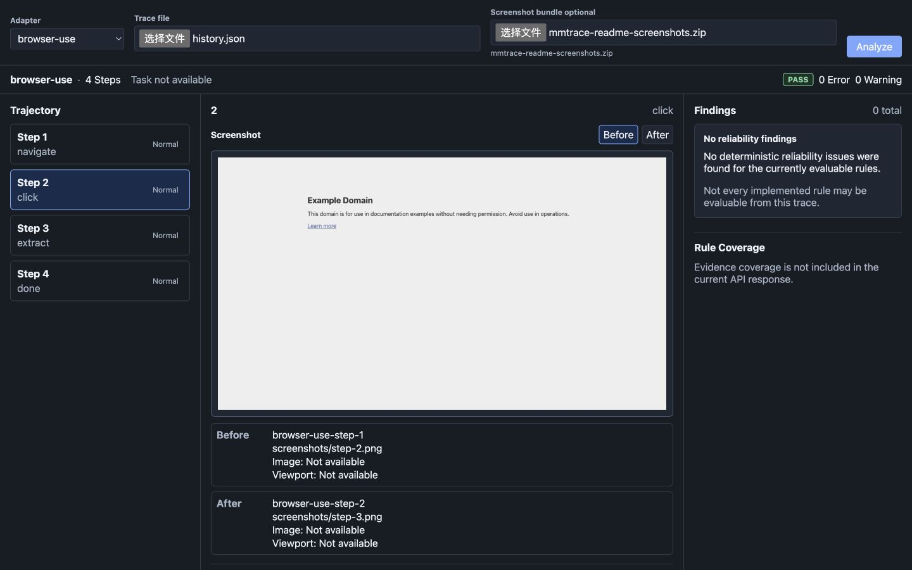

# MMTrace

[English](README.md) | 简体中文

面向多模态 / Computer-Use Agent 的确定性可靠性检查与轨迹（Trace）检查工具。

MMTrace 用于验证 Agent 轨迹中是否存在可信的证据链：

```text
Observation -> Model Context -> Action -> Execution -> Post-State
```

MMTrace 刻意保持小而清晰。它不是通用 Agent 调试器、语义裁判、恢复框架、Dashboard 平台或 Agent runtime。

使用 MMTrace 检查真实 Browser Use 运行轨迹。



## Why MMTrace

Agent 失败并不总是推理失败。很多时候，轨迹本身就缺少可信证据：截图缺失、model context 没有引用被观察到的状态、坐标与画面不匹配、动作缺少执行证据，或者成功动作没有 Post-State 验证。

MMTrace 专注于记录证据上的确定性检查。当某条规则所需的证据不存在时，规则会跳过，而不是猜测。

## What MMTrace Does

- 将 Agent 轨迹标准化为统一 schema
- 运行确定性可靠性检查
- 生成基于证据的检查结果（Finding）
- 提供 CLI 和 JSON report
- 提供本地 FastAPI backend 与 React Trace Inspector，用于可视化审查

## Reliability Rules

- `MMTRACE001` - Missing Observation
- `MMTRACE002` - Observation Not In Model Context
- `MMTRACE003` - Coordinate Out Of Frame
- `MMTRACE004` - Coordinate Space Mismatch
- `MMTRACE005` - Stale Observation
- `MMTRACE006` - Missing Post-Action Verification

并不是每个适配器（Adapter）都能提供每条规则需要的 evidence。IMPLEMENTED 不等于 EVALUABLE。

## Architecture

```text
Agent Trace
    |
    v
Adapter
    |
    v
MMTrace Core
    |-- CLI / JSON Report
    |
    `-- FastAPI
            |
            v
       Trace Inspector
```

MMTrace Core 负责 schema、adapters、确定性检查和 reports。FastAPI 负责 HTTP transport、上传文件、临时 screenshot artifacts 和序列化。React 只负责可视化和交互。

Web artifact URL 属于传输层数据，不会写入 `Trace`、`Observation`、`Finding` 或 `Report`。

## CLI Quick Start

以 editable mode 安装：

```bash
python3 -m pip install -e .
```

检查标准 MMTrace JSON 文件：

```bash
mmtrace check trajectory.json
```

检查 Browser Use history 文件：

```bash
mmtrace check history.json --adapter browser-use
```

输出机器可读 JSON：

```bash
mmtrace check history.json \
  --adapter browser-use \
  --format json
```

只运行单条规则：

```bash
mmtrace check trajectory.json \
  --rule MMTRACE003
```

## Trace Inspector

Web MVP 提供一个本地 Trace Inspector，包括：

- `generic` 与 `browser-use` Adapter 选择
- JSON 轨迹上传
- 可选 screenshot ZIP 上传
- Trace summary、trajectory list、step inspector 和 findings panel
- 通过 `/api/artifacts/...` 查看真实 screenshot
- 当 Before / After 两侧 screenshot 都存在时支持切换

Screenshot artifacts 是可选 evidence。即使不上传 ZIP，分析流程仍会正常工作，UI 会明确显示 screenshot artifact unavailable。

## Run Locally

Backend：

```bash
python3 -m pip install -e ".[web,test]"
python3 -m uvicorn web.backend.app:app \
  --host 127.0.0.1 \
  --port 8000
```

Frontend：

```bash
cd web/frontend
npm ci
npm run dev
```

打开 Vite 输出的 URL。前端通过开发代理访问 `/api`，因此本地开发不需要额外配置 CORS。

## Using Browser Use Example

项目包含一条真实 Browser Use 轨迹：

```text
examples/browser_use_real/history.json
```

使用 Adapter：

```text
browser-use
```

如需查看 screenshot，可从以下目录创建一个临时 ZIP：

```text
examples/browser_use_real/screenshots/
```

在 Trace Inspector 中上传该 ZIP 作为 optional Screenshot bundle。不要把临时 ZIP 存入仓库。

CLI：

```bash
mmtrace check examples/browser_use_real/history.json --adapter browser-use
```

当前结果：

```text
Status: PASS
Errors: 0
Warnings: 0
```

该示例保留了 4 个 Browser Use source actions，并映射为 4 个 MMTrace actions。上传 screenshot ZIP 后，Web Inspector 可以映射其中 3 个已保存 screenshot observations。

## Evidence Limitations

IMPLEMENTED 不等于 EVALUABLE。

规则只会在所需 evidence 存在时运行。没有 Finding 并不证明 Agent 一定正确、安全，或每条规则都已被充分评价。

普通 Browser Use history 目前存在重要证据边界：

- 它不能证明真实 model input messages，因此 `MMTRACE002` 通常不可评价。
- 坐标、viewport dimensions 和 coordinate-space metadata 可能缺失。
- 精确的 observation/action timestamps 可能缺失。
- 并非每条已实现规则都能在每条轨迹上评价。
- 没有检查结果不等于 Agent 正确。

Trace Inspector 会保留这个区别。它的 PASS 状态表示：在当前可评价 evidence 下，没有发现确定性可靠性 Finding。

## Exit Codes

```text
0  Check completed and no ERROR findings were reported.
1  Check completed and at least one ERROR finding was reported.
2  Input, argument, schema, or adapter error.
```

WARNING 不会导致 exit code `1`。

## Development

Python：

```bash
python3 -m pytest -q
python3 -m pip check
```

Frontend：

```bash
cd web/frontend
npm ci
npm run typecheck
npm run build
```

## CI

GitHub Actions 当前运行：

- Python 3.11 和 3.12
- `python -m pip install -e ".[web,test]"`
- `python -m pytest -q`
- `python -m pip check`
- Node 20
- `npm ci`
- `npm run typecheck`
- `npm run build`

CI 不需要 secrets，也不会调用 SiliconFlow、Browser Use 或任何 Agent runtime。

## Packaging Boundary

Python package 是 MMTrace core package。当前 Web MVP 面向从本仓库 source checkout 的本地开发使用。

不要假设只安装 wheel 就会包含一个可独立运行的前端应用。

## Project Status

MMTrace 当前处于 v0.1 Core + Trace Inspector Web MVP 阶段。它是一个早期、local-first 的可靠性检查与检查器，不是生产平台。
