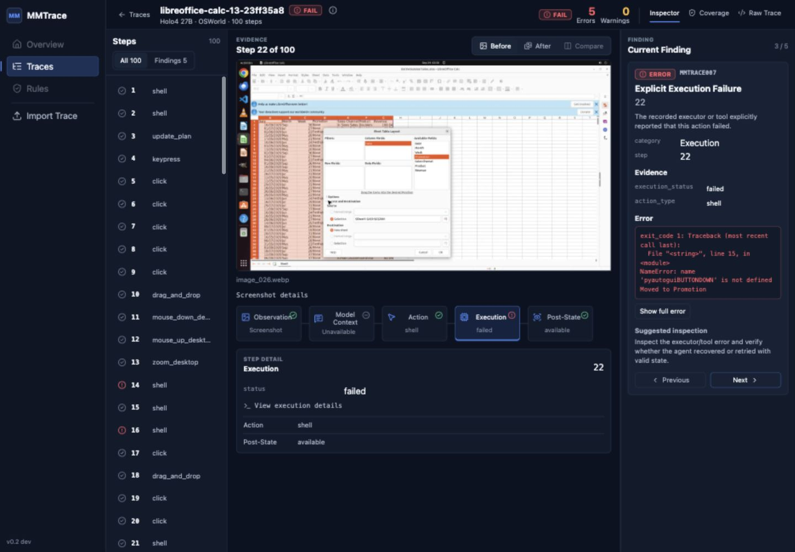
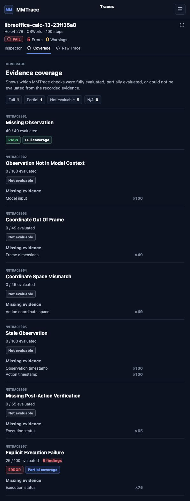
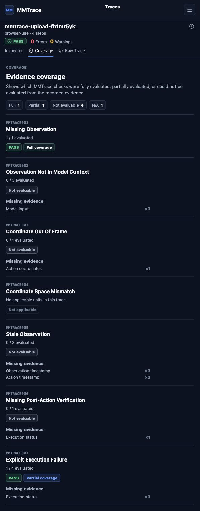
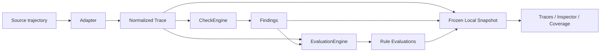

# MMTrace

[English](README.md) | 简体中文

[](https://github.com/Gnomeshgh412/mmtrace/actions/workflows/tests.yml)

[](LICENSE)

MMTrace 是一个面向多模态与 Computer-Use Agent 轨迹的确定性可靠性检查、Trace 调试与证据感知覆盖工具。

MMTrace 检查记录在轨迹（Trace）中的确定性可靠性约束，核心证据链是：

```text
Observation -> Model Context -> Action -> Execution -> Post-State
```

它不仅报告检测到了什么失败，也报告哪些检查因为缺少必要证据而无法充分评估。可以把它类比为面向已记录 Agent 轨迹的 pytest / ESLint 风格可靠性检查器。

MMTrace 刻意保持小而清晰。它不是通用观测平台、语义裁判、恢复框架、Agent runtime，也不证明 Agent 已经正确完成任务。

## 为什么需要 MMTrace

多模态和 Computer-Use Agent 经常留下不完整或不一致的轨迹证据。截图可能缺失，model context 可能没有包含被观察到的状态，坐标可能不匹配记录的画面，工具执行可能失败，或者一次改变状态的成功动作之后没有 post-state 验证。

MMTrace 会把记录下来的轨迹标准化，在真实存在的证据上运行确定性检查，并在证据缺失时明确保留这个边界。



真实 Holo4 / OSWorld 轨迹：MMTrace 在 Inspector 中展示 explicit execution failure，并串联 observation、action、execution 与 post-state 证据。该截图不声称所显示的 post-state 一定是错误发生后的立即下一帧。

## Findings vs. Evidence Coverage

没有 Finding 并不意味着整条轨迹已经被充分验证。

一条规则没有产生 Finding，可能是因为所需证据存在且被评估的单元通过了检查；也可能是因为 Trace 中没有记录足够证据，导致该规则无法评估。MMTrace v0.2 会显式区分这两种情况。

- 检测项（Finding）是在记录证据中实际检测到的确定性可靠性问题。
- Report `PASS` 表示没有检测到 `ERROR` Finding。
- Report `FAIL` 表示至少检测到一个 `ERROR` Finding。
- 只有 warning 不会让 Report 变成 `FAIL`。
- 检查结果（Outcome）包括：`PASS`、`WARNING`、`ERROR`、`NONE`。
- 证据覆盖（Coverage）包括：`FULL`、`PARTIAL`、`NOT_EVALUABLE`、`NOT_APPLICABLE`。
- 缺失证据（Missing evidence）说明适用单元为什么无法检查。

`PASS` 不代表所有规则都被充分评估，也不代表任务语义正确或整条轨迹已经被验证。

### Holo4 的覆盖边界

真实 Holo4 / OSWorld case 的 Report 是：

```text
Status: FAIL
Errors: 5
Warnings: 0
```

MMTrace 检测到 5 个 explicit execution failure，全部报告为 `MMTRACE007`。但 Coverage 视图也展示了这个结论的边界：对于 `MMTRACE007`，100 个适用 action unit 中只有 25 个有足够的 execution-status 证据可以评估；另外 75 个因为缺少 `execution.status` 而不可评估。



`MMTRACE007` 是 `ERROR` + `PARTIAL` 证据覆盖：5 个 Finding，25 / 100 evaluated，并缺少 `Execution status x75`。

### Browser Use：PASS 不等于充分验证

Browser Use 示例的 Report 是：

```text
Status: PASS
Errors: 0
Warnings: 0
```

这只表示在当前可评估证据中没有检测到 error finding。多条规则仍然是 `NOT_EVALUABLE`，因为导出的 history 不包含真实 model input、timestamps、action coordinates 或 execution status 等必要证据。



`MMTRACE007` 是 `PASS` + `PARTIAL` 证据覆盖：4 个 action unit 中只有 1 个可评估，另外 3 个缺少 execution status。

## Quick Start

从仓库安装：

```bash
git clone https://github.com/Gnomeshgh412/mmtrace.git
cd mmtrace
python3 -m pip install -e .
```

运行内置 Holo4 示例：

```bash
mmtrace check \
  examples/holo4_real_execution_failure/trajectory.json \
  --adapter holo4
```

预期摘要：

```text
Status: FAIL
Errors: 5
Warnings: 0
Rule findings:
MMTRACE007 x5
```

当前 CLI text formatter 只输出 Findings。Evidence Coverage 目前在持久化 Web Inspector 中展示，不在 CLI text 输出中展示。

CLI reference：

```bash
mmtrace check INPUT
mmtrace check INPUT --adapter generic
mmtrace check INPUT --adapter browser-use
mmtrace check INPUT --adapter osworld
mmtrace check INPUT --adapter holo4
mmtrace check INPUT --format json
mmtrace check INPUT --output report.json
mmtrace check INPUT --rule MMTRACE003
mmtrace serve
mmtrace serve --host 127.0.0.1 --port 8000
```

Exit codes：

```text
0  Check completed and no ERROR findings were reported.
1  Check completed and at least one ERROR finding was reported.
2  Input, argument, schema, or adapter error.
```

## Web Workflow

从源码仓库构建 production Web UI，并用一个本地服务进程启动：

```bash
python3 -m pip install -e ".[web]"

cd web/frontend
npm ci
npm run build
cd ../..

mmtrace serve
```

打开：

```text
http://127.0.0.1:8000
```

`mmtrace serve` 会从同一个本地 Uvicorn 进程同时服务已构建的 Web UI 和 `/api/*`。默认 host 是 `127.0.0.1`，默认 port 是 `8000`。

v0.2 的 Web UI 当前从源码仓库启动；frontend assets 尚未打包进 Python wheel。如果 production frontend build 不存在，`mmtrace serve` 会退出并打印构建命令。

第一次 checkout 后，或 frontend source 更新后，需要重新构建 frontend：

```bash
cd web/frontend
npm ci
npm run build
```

frontend build 完成后，运行时不需要 Vite dev server 或 Node process。

MMTrace 默认绑定到 `127.0.0.1`，因为 traces 和 screenshots 可能包含敏感数据。如果显式使用 `--host 0.0.0.0`，本地 Web UI 可能会对同一网络中的其他设备可见。

v0.2 工作流：

```text
Import Trace
  -> Adapter normalization
  -> CheckEngine findings
  -> EvaluationEngine coverage
  -> Frozen local snapshot
  -> Traces workspace
  -> Inspector
  -> Evidence Coverage
  -> Reopen persisted analysis
```

分析结果会在本地持久化，backend 重启后仍可以从 Traces workspace 重新打开。

如果进行 frontend development，仍然可以单独运行 Vite：

```bash
python3 -m pip install -e ".[web]"
python3 -m uvicorn web.backend.app:app \
  --host 127.0.0.1 \
  --port 8000

cd web/frontend
npm ci
npm run dev
```

打开 Vite 输出的 URL。frontend development server 会通过代理访问 `/api`。

## Reliability Rules

| Rule | Check | Severity |
| --- | --- | --- |
| `MMTRACE001` | Missing Observation | ERROR |
| `MMTRACE002` | Observation Not In Model Context | ERROR |
| `MMTRACE003` | Coordinate Out Of Frame | ERROR |
| `MMTRACE004` | Coordinate Space Mismatch | ERROR |
| `MMTRACE005` | Stale Observation | WARNING |
| `MMTRACE006` | Missing Post-Action Verification | WARNING |
| `MMTRACE007` | Explicit Execution Failure | ERROR |

规则是否可评估取决于每条检查所需的证据。适配器会标准化已记录证据，但不会伪造缺失证据。

## 真实示例

| Example | Adapter | Report | Coverage highlight | Demonstrates |
| --- | --- | --- | --- | --- |
| Holo4 / OSWorld | `holo4` | FAIL · 5E · 0W | `MMTRACE007`: ERROR + PARTIAL, 25 / 100 | explicit executor failures 与覆盖边界 |
| Browser Use | `browser-use` | PASS · 0E · 0W | 多条 `NOT_EVALUABLE`; `MMTRACE007`: PASS + PARTIAL, 1 / 4 | PASS 不等于充分验证 |
| OSWorld | `osworld` | FAIL · 1E · 10W | `MMTRACE003`: PARTIAL / ERROR; `MMTRACE005`: FULL / WARNING | 坐标边界与 stale-observation 检查 |

示例路径：

- `examples/holo4_real_execution_failure/`
- `examples/browser_use_real/`
- `examples/osworld_real_failure/`

Holo4 示例保留了一条来自 [`Hcompany/trajectories`](https://huggingface.co/datasets/Hcompany/trajectories) 的未修改公开轨迹：[OSWorld](https://github.com/xlang-ai/OSWorld) task `libreoffice-calc-13-23ff35a8`，model 为 Holo4 27B。该 fixture 没有 fault injection，也没有合成 execution metadata。

Browser Use 示例是真实 no-login Browser Use history，任务访问 `example.com`。它的 `PASS` report 很有价值，因为 Coverage 视图明确展示了哪些检查无法从导出的 history 中评估。

## Supported Adapters

- `generic`：直接读取标准化 MMTrace JSON schema。
- `browser-use`：标准化 Browser Use history export，不伪造缺失的 model input 或 execution-status 证据。
- `osworld`：标准化 OSWorld `traj.jsonl` 轨迹和截图引用。
- `holo4`：标准化 OSWorld 风格任务中的 Holo4 trajectory JSON，并在存在时保留 executor/tool output。

## Architecture



`CheckEngine` 产生 Findings。Report 状态由 Findings 决定：只要存在 `ERROR` Finding，Report 就是 `FAIL`。

`EvaluationEngine` 产生规则可评估性和证据覆盖。它解释每条规则在记录证据下是 fully evaluated、partially evaluated、not evaluable，还是 not applicable。

## Local Persistence

MMTrace 是 local-first。Web workflow 会把分析结果存储在：

```text
~/.mmtrace/
```

本地 workspace 包含 SQLite catalog 和冻结的 analysis snapshots。可以通过 `MMTRACE_HOME` 指定其他存储位置：

```bash
MMTRACE_HOME=/path/to/mmtrace-home mmtrace serve
```

MMTrace 的本地 workspace 会在本机持久化 MMTrace 分析结果。但它不对原始 agent、model 或 benchmark workflow 在导入 Trace 之前的数据流向作额外声明。

## Limitations and Non-goals

- MMTrace 检查确定性的轨迹可靠性约束。
- 它不判断任务语义正确性。
- 它不证明 Agent 正确或安全。
- 它依赖 source trace 和 adapter 暴露的证据。
- 当必要证据缺失时，它会把规则标记为 `NOT_EVALUABLE`。
- 它不会用 LLM 或 vision model 推断缺失证据。
- `FULL` 证据覆盖只表示该规则的所有适用单元都有足够记录证据可供评估；它不表示任务正确。

## Development

Python：

```bash
python3 -m pytest -q
python3 -m pip check
```

Frontend：

```bash
cd web/frontend
npm ci
npm run typecheck
npm run build
```

CI 当前运行 Python 3.11 / 3.12 tests、`pip check`、frontend typecheck 和 frontend build。

## Project Status

`main` branch 包含即将发布的 v0.2 feature set，包括 local persistence、Traces workspace 和 evidence-aware rule coverage。

v0.2 的 Web UI 当前从源码仓库启动；frontend assets 尚未打包进 Python wheel。

最新 tagged release：`v0.1.0`

在 v0.2 release polish 和 release step 完成之前，package version 仍保持 `0.1.0`。

## License

MMTrace 使用 [MIT License](LICENSE) 发布。

示例 traces 和 screenshots 可能包含上游 benchmark 或 dataset material，并受其各自 license 或 terms 约束。
